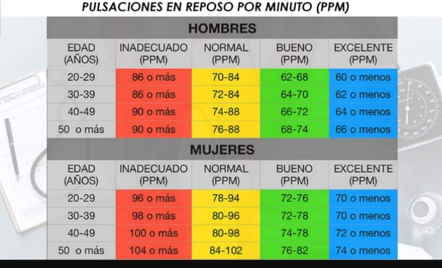

## TO DO

## INTENTO 1
0. He ejecutado el csv del dataset general
1. He convertido todos los strings de NAs a NAs de NUMPY
2. He hecho una division de las variables numéricas y categóricas del dataset
3. Con el SimpleImputer he imputado los valores faltantes usando la media para las variables numéricas y el valor mas repetido (moda) para las variables categóricas
4. He separado train en train y validación y aplicado SMOTE sobre el train.
5. Grid y selección del mejor modelo:  Random Forest
   
## TRY
Random Forest 0.54891

## INTENTO 2 
0. He ejecutado el csv del dataset general
1. He convertido todos los strings de NAs a NAs de NUMPY
2. He hecho una division de las variables numéricas y categóricas del dataset
3. Con el SimpleImputer he imputado los valores faltantes usando la media para las variables numéricas y el valor mas repetido (moda) para las variables categóricas // **CON ALGUNAS EXCEPCIONES**
4. He parametrizado la variable CHOL para que el output sea categórico 
5. **chol**
   > **Colesterol sérico** Normal : Menos de 200 mg/dl , Límite superior del rango normal: Entre 200 y 239 mg/dl , Alto: 240 mg/dl o más, los nulls o 0 se tratan como una categoría a parte.
6. He creado un nuevo posible valor en la variable THAL que corresponde a los valores NaN
7. He estandarizado todas variables cuantitativas continuas.
8. He separado train en train y validación y aplicado SMOTE sobre el train.
9. Grid y selección del mejor modelo : Random Forest
    
## TRY
Random Forest 0.53260

## INTENTO 3
0. He ejecutado el csv del dataset general
1. He convertido todos los strings de NAs a NAs de NUMPY
2. He hecho una division de las variables numéricas y categóricas del dataset
3. He calculado la media ral sin NaNs para la variable TALACH y he rellenado los NaNs con esta.
4. He parametrizado la variable CHOL y TRESBPS para que el output sea categórico
5. He creado  umbrales para la variable **trestbps**
   > **Presión arterial sistólica**  Normal:  Menos de 120  mm Hg , Elevada: 120-129 mmHg , Presión arterial alta: 130 mm Hg o más, los nulls se tratan como una categoría a parte
6. Con el SimpleImputer he imputado los valores faltantes usando la media para las variables numéricas y el valor mas repetido (moda) para las variables categóricas // **CON ALGUNAS EXCEPCIONES** 
7.  He creado  umbrales para la variable **chol**
   > **Colesterol sérico** Normal : Menos de 200 mg/dl , Límite superior del rango normal: Entre 200 y 239 mg/dl , Alto: 240 mg/dl o más, los nulls o 0 se tratan como una categoría a parte.
8. He creado un nuevo posible valor en la variable THAL que corresponde a los valores NaN
9. He creado una nueva varibale a raíz de la variable TALACH, SEX Y AGE que categorizo en función de esta tabla 
10. He estandarizado todas variables cuantitativas continuas que quedan (AGE y OLDPEAK).
11. He separado train en train y validación y aplicado SMOTE sobre el train. 
12. Grid y selección del mejor modelo : Random Forest
    
## TRY
Random Forest 0.54347

## INTENTO 4 
1. Lo mismo que el 3 pero estandarizando las variables categóricas de la siguiente forma :
   1.  Ordinal encoding en las variables slope, ca y thal y restecg. 
   2.  Count encoding en las variables chol ,**thalach_cat** , trestbps y cp.
   
## TRY 

Random Forest 0,56521
## INTENTO 5

1. Eliminar talach_cat y dejar solo talach . Mantener el count de tresbps y chol.
2. eliminar negatrivos oldpeak == LOS PASO A POSITIVOS , SE PRODUJO ERROR ENTRADA DATOS?
3. dropeamos variable CA
4. Tratar variables mas importantes old peak, age, talach 
5. eliminar caracteristicas poco importantes 
6. crear para thal un nuevo nivel en 0 , desconocido 

## TRY 

No probado

## INTENTO 6

Lo mismo que el 5 pero sin count encodig para variables chol ,trestbps y cp

## TRY 

Random Forest 0,53804

## INTENTO 7

Lo mismo que el 6 pero dropeando ca y slope

## TRY

No probado

## INTENTO 8 

Lo mismo que el 8 pero las variables chol y trestbps las dejamos continuas

## TRY

Random Forest 0,51086

## INTENTO 9 

Probamos a eliminar las variables con muchos nulos sin sentido y NaNs, dejamos solo las variables:
Age
Sex
Cp
tresbps
fbs
restecg
thalach
exang
oldpeak  == PROBAR SIN TENER COMO VALOR ABSOLUTO 

## INTENTO 10

Lo mismo que el anterior pero aplicando Min-Max para las variables cuantitativas

y subsampling y oversampling para los grupos mayoristas y minoristas

## INTENTO 11 == 4.1

He tirado con MinMax, con standard Scaler cambia uno. Sera para mejor?
Oldpeak con media para los negativos, he probado y empeora.
SIN SMOTE 
## TRY 
Random Forest 0.57608
Como mejoramos?

## INTENTO 12 == 4.2

Igual que el anterior pero sin usar valores absolutos para oldpeak y sin estandarizar talach.

## TRY

Random Forest, fracaso 0,53...

## INTENTO 13 == 4.3 
Lo mismo que es intento 11 pero añadiendo las correlaciones de Nacho.

 ## TRY 

 Random Forest, fracaso 0,534...

 ## INTENTO 14 == 4.4

 Lo mismo que el try 4 pero he cambiado el modelo a Catboost

## TRY
Cat Boost : 0.59239 

## INTENTO 15 
 
 Cojo el try anterior y no trato los NaNs de las variables categoricas, ya que el propio modelo de catboost las puede tratar, tambien elimino el conteo de las variables chol ,**thalach_cat** , trestbps y cp.

## TRY

## INTENTO 16

 Elimino la variable thalach_cat al ver que no tiene buenos scores, y la dejo como cuantitativa y la estandarizo. Le meto los mejores parametros del grid

 Cat Boost : 0.57608 
 QUIERO PROBAR EL TRY 56 que es con los parametros del modelo antiguo  {'depth': 8, 'iterations': 30, 'l2_leaf_reg': 1, 'learning_rate': 0.01

Cat Boost Fracaso, 0.53260
## IDEAS
1.CLASSWEIGHTS

| Categoria   | Entradas | Porcentaje | Corresponderían en 184 entradas |  EL MEJOR HASTA LA FECHA 
|-------------|----------|------------|---------------------------------|
| Categoria 0 | 327      | 44.67%     | 82                              |  96
| Categoria 1 | 156      | 21.31%     | 39                              |  37
| Categoria 2 | 108      | 14.75%     | 27                              |  28
| Categoria 3 | 107      | 14.62%     | 27                              |  23
| Categoria 4 | 34       | 4.64%      | 9                               |  0

1. Importancia de características (Feature Importance)
Muchos modelos de machine learning, especialmente los basados en árboles como Random Forest y XGBoost, ofrecen una forma directa de evaluar la importancia de las características. Esta importancia se mide en función de cómo cada característica mejora el rendimiento del modelo, por ejemplo, cómo reduce la impureza en un árbol de decisión.

2. Coeficientes de modelos lineales
Para modelos lineales (como la regresión lineal o logística), los coeficientes asociados a cada variable indican su importancia. Un coeficiente grande en valor absoluto sugiere que la variable correspondiente es importante para predecir la variable objetivo.

3. Eliminación recursiva de características (RFE)
La Eliminación Recursiva de Características (RFE) es un enfoque que consiste en construir un modelo y elegir las características más importantes, eliminando las menos importantes de manera recursiva hasta que se alcanza el número deseado de características.

4. Permutación de importancia de características
Este método implica mezclar los valores de cada característica, uno por uno, y medir cómo afecta el desempeño del modelo. Una gran disminución en el rendimiento al permutar los valores de una característica indica que esa característica es importante para el modelo.

5. SHAP (SHapley Additive exPlanations)
SHAP es un enfoque basado en la teoría de juegos para medir la importancia de las características. Proporciona una medida de la contribución de cada característica a la predicción de cada muestra. SHAP es útil porque ofrece explicaciones interpretables para cualquier modelo de machine learning.

6. Análisis de Componentes Principales (PCA)
Aunque PCA es más una técnica de reducción de dimensionalidad que un método directo para evaluar la importancia de las características, puede ser útil para identificar las combinaciones de características que capturan la mayor variabilidad en los datos.

